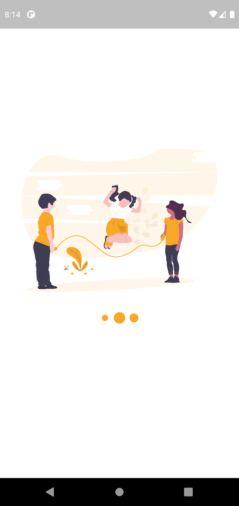
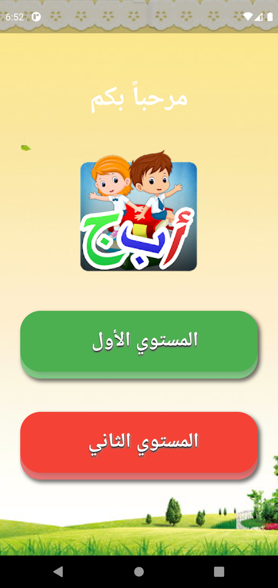
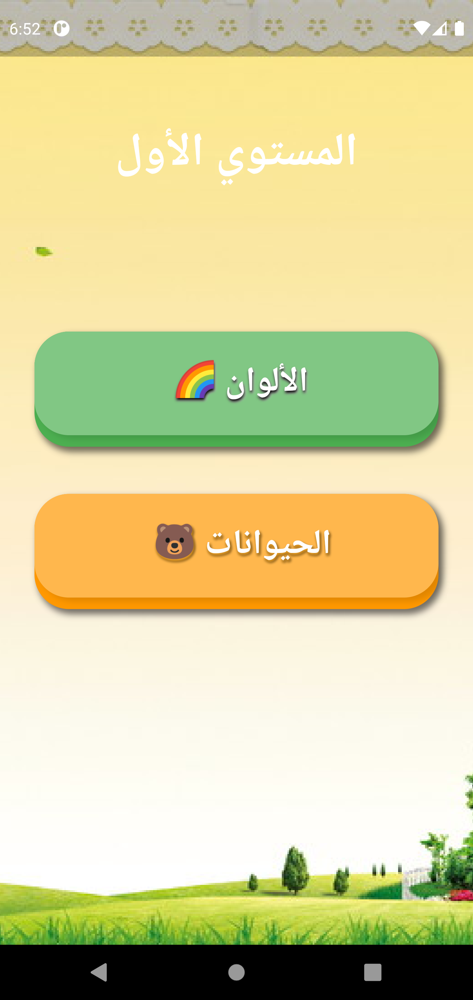

# kidsGame

A new Flutter project.

## Getting Started

This project is a starting point for a Flutter application.

A few resources to get you started if this is your first Flutter project:

- [Lab: Write your first Flutter app](https://flutter.dev/docs/get-started/codelab)
- [Cookbook: Useful Flutter samples](https://flutter.dev/docs/cookbook)

For help getting started with Flutter, view our
[online documentation](https://flutter.dev/docs), which offers tutorials,
samples, guidance on mobile development, and a full API reference.

#Learning Arabic Language Game

    
content1

    
content2

content1
 
content1

<!DOCTYPE html>
<html lang="en">

<body>
  

   

       
   

  

       
  

  

       
  

    

</body>
</html>

